# 02.案例分析

以YouTube播放量为例，通过过去日期的播放量，预测未来的播放量。

机器学习**训练（Train）**的步骤：

- **建立模型model（function with unknown parameter）**

    线性模型liner model、非线性模型

    首先考虑线性模型，y = wx1 + b。

- **计算损失Loss**（对于训练数据而言）

    损失函数，输入为模型的参数，输出为一个数值。

    常用的损失函数有：MAE（平均绝对误差）、MSE（平均平方误差）、交叉熵

- **最优化Optimization**

    找到最佳的模型参数，目标就是使得损失函数Loss值最小，即：arg min：L(w,b).

    方法就是**梯度下降（Gradient Descent）。**

    梯度下降的基本过程：随机选取一个初始点，计算该点对应的梯度，梯度值的正负决定了移动的方向，梯度值的大小决定了移动的步幅。

    这里存在着局部最小的疑惑，后面会有解答！

    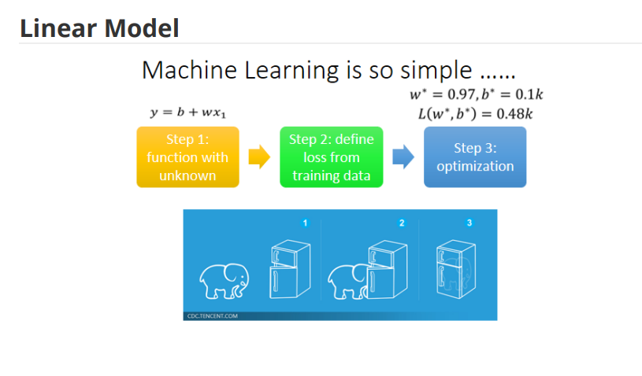

- 这里需要注意：上述三个步骤仅仅是训练的过程，也就是我们是在知道一直答案的情况下进行的过程，相当于自嗨。我们真正在意的是预测。

---

在模型选择上，除了简单的线性模型外，我们还需要考虑**分段线性模型**（Piecewise linear Curves）。

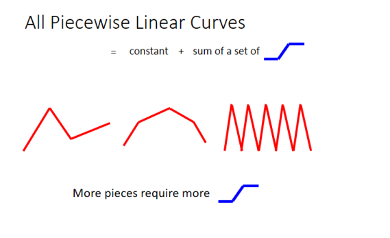

除了分段线性曲线外，可能所需模型更加复杂，例如：**Continuous curve。**

所以就是一个不断逼近的过程：

**target：Continuous curve—-》piecewise linear curve—》constant+ sum of a set of (hard sigmoid)**

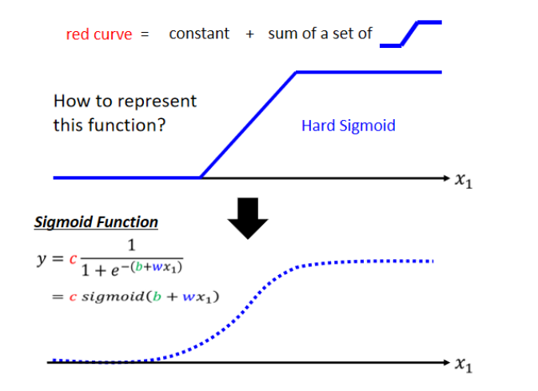

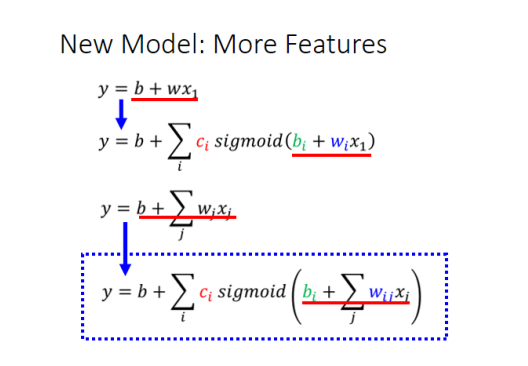

将上述公式转换为线性代数的形式，如下：

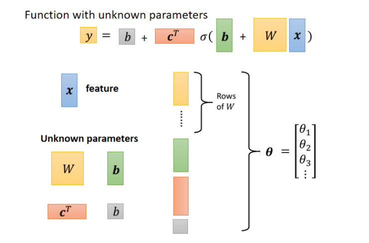

通过上述变形操作，我们得到了**多个特征情况**下的**flexible模型**。

接着需要定义训练数据的Loss：

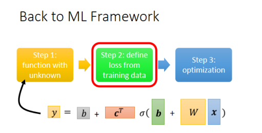

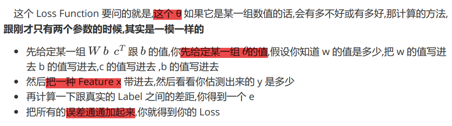

最优化：

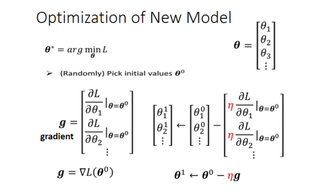

**mini-batch gradient descent：**

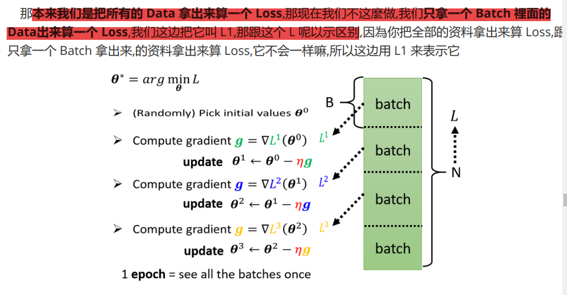

**激活函数的变形：**

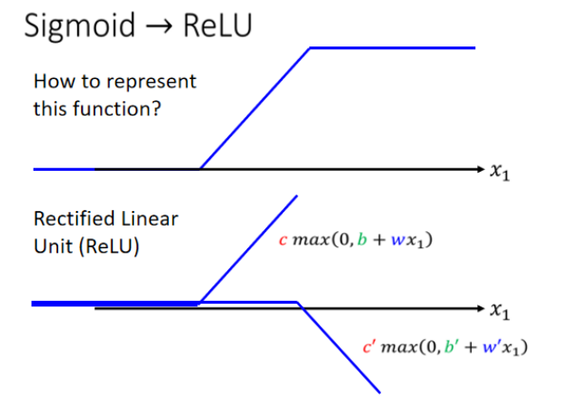

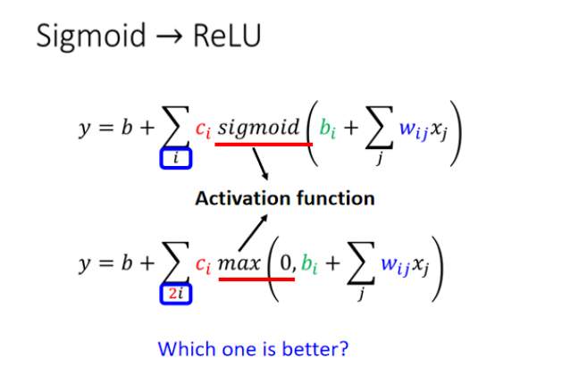

优化模型：激活函数的选择、模型层数的添加